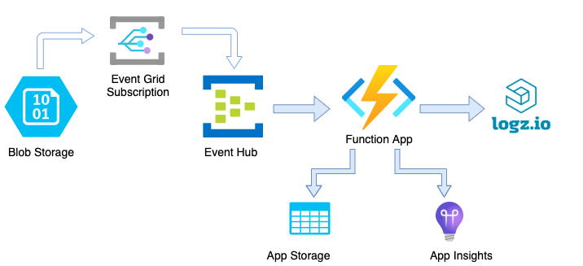
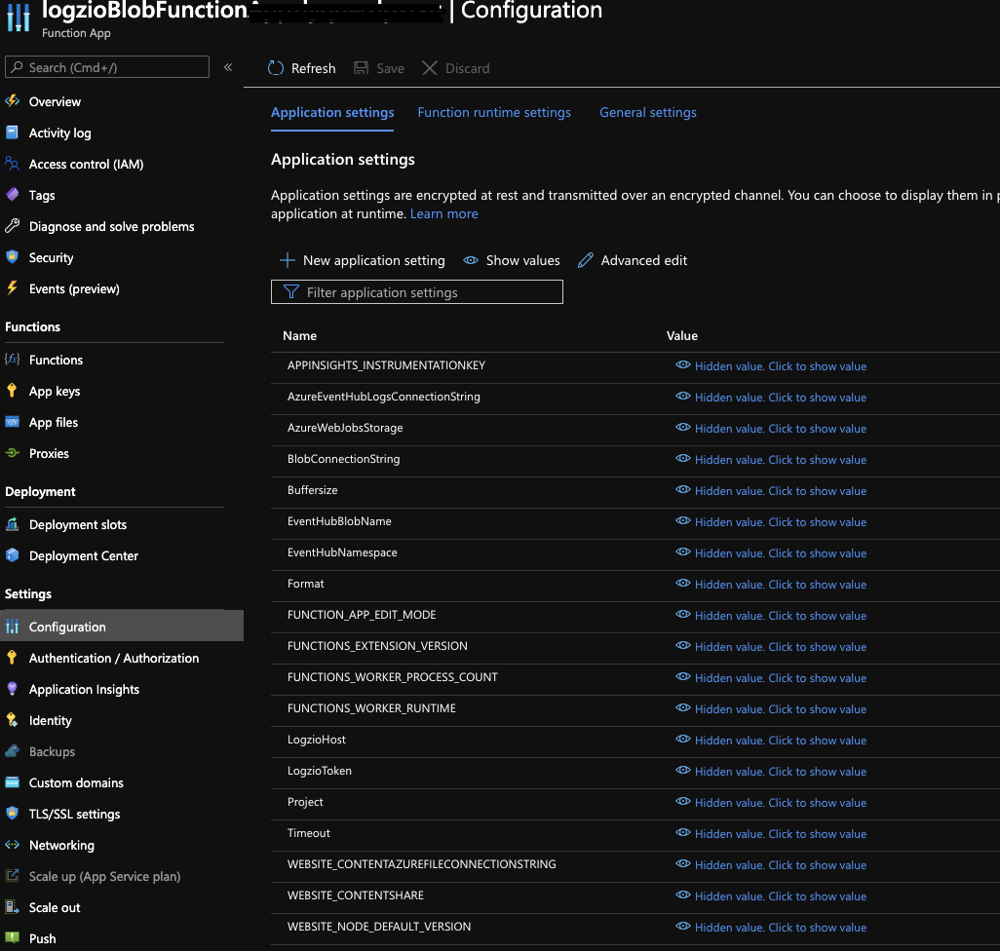

# Ship logs from Azure Blob Storage

Shield: [![CC BY 4.0][cc-by-shield]][cc-by]

This work is licensed under a
[Creative Commons Attribution 4.0 International License][cc-by].

[![CC BY 4.0][cc-by-image]][cc-by]

[cc-by]: http://creativecommons.org/licenses/by/4.0/
[cc-by-image]: https://i.creativecommons.org/l/by/4.0/88x31.png
[cc-by-shield]: https://img.shields.io/badge/License-CC%20BY%204.0-lightgrey.svg

Logz.io provides an automated deployment process to simplify the process of shipping logs from Azure Blob Storage.	
This integration forwards logs from your Azure Blob Storage	
to your Logz.io account.

<!-- tabContainer:start -->

## Deployment options:

* [Use your existing blob storage account](#existing-blob-config)
* [Create a new blob storage account](#new-blob-config)

These deployments will create the following services:
* Serverless Function App
* Application Insights
* App Service Plan
* Event Hubs Namespace
* Event Grid System Topic
* Storage account for the function's logs
* If you select the option to deploy a new account, a new Blob Storage account will be created as well.

<!-- tab:start -->

# Use your existing blob storage account

**Before you begin, you'll need**:
A Blob storage account of the type **StorageV2 (general purpose v2)** . If your existing blob storage account is of any other kind, it will NOT work. Instead, follow the process to set up a new blob storage account.
Double-check your [_Storage accounts_](https://portal.azure.com/#blade/HubsExtension/BrowseResource/resourceType/Microsoft.Storage%2FStorageAccounts) to make sure that they are compatible. They should be of the type **StorageV2 (general purpose v2)**.

## Configure an automated deployment

👇 Click this button to start the automated deployment.

You'll be taken to Azure,
where you'll configure the resources to be deployed.
Make sure to use the settings shown below.

| Parameter | Description |
|---|---|
| Resource group* | Select your existing resource group, and then click **OK**. |
| Region* | Select the same region as the Azure services that will stream data to this Blob Storage. |
| Logzio host* | Use the listener URL specific to the region of your Logz.io account. You can look it up [here](https://docs.logz.io/user-guide/accounts/account-region.html). |
| Log shipping token* | Add the [log shipping token](https://app.logz.io/#/dashboard/settings/general) for the relevant Logz.io account. This is the account you want to ship to.  |
| Format* | Select one of the supported parsing formats: text/json/csv.  |
| Blob Storage Account Name* | Insert the name of the storage account that contains the logs.  |
| Buffersize (Default: 100) | The maximum number of messages the logger will accumulate before sending them all as a bulk.  |
| Timeout (Default: 180,000 = 3 minutes) | The read/write/connection timeout in *milliseconds*.  |

*Required fields  

At the bottom of the page, select **Review + Create**, and then click **Create** to deploy.  
Deployment can take a few minutes.

## Check Logz.io for your logs

Give your logs some time to get from your system to ours, and then open [Kibana](https://app.logz.io/#/dashboard/kibana/discover?). 
Please note that only logs sent from this point on would be sent and appear under the type `blobStorage`.

If you still don’t see your logs, see [log shipping troubleshooting](https://docs.logz.io/user-guide/log-shipping/log-shipping-troubleshooting.html).

For information about working with your parameters after deployment press [here](#parameters-after-deploy).

<!-- tab:end -->

<!-- tab:start -->

# Set up a new blob storage account

## Configure an automated deployment

👇 Click this button to start the automated deployment.

You'll be taken to Azure,
where you'll configure the resources to be deployed.
Make sure to use the settings shown below.

| Parameter | Description |
|---|---|
| Resource group* | Click Create new. Give a meaningful Name, such as "logziobBlobStorageIntegration", and then click OK. |
| Location* | Select the same region as the Azure services that will stream data to this Blob Storage. |
| Logzio host* | Use the listener URL specific to the region of your Logz.io account. You can look it up [here](https://docs.logz.io/user-guide/accounts/account-region.html). |
| Log shipping token* | Add the [log shipping token](https://app.logz.io/#/dashboard/settings/general) for the relevant Logz.io account. This is the account you want to ship to.  |
| Format* | Select one of the supported parsing formats: text/json/csv |
| Buffersize (Default: 100) | The maximum number of messages the logger will accumulate before sending them all as a bulk  |
| Timeout (Default: 180,000 = 3 minutes) | The read/write/connection timeout in *milliseconds*.  |

*Required fields  

At the bottom of the page, select **Review + Create**, and then click **Create** to deploy.  
Deployment can take a few minutes.

## Check Logz.io for your logs
Give your logs some time to get from your system to ours, and then open [Kibana](https://app.logz.io/#/dashboard/kibana/discover?). 
Please note that only logs sent from this point on would be sent and appear under the type `blobStorage`.

If you still don’t see your logs, see [log shipping troubleshooting](https://docs.logz.io/user-guide/log-shipping/log-shipping-troubleshooting.html).

<!-- tab:end -->

### Updating parameters after deployment

Some parameters can be updated post-deployment. These include:

* Shipper-related configurations: **LogzioHost**, **LogzioToken**, **Buffersize**, **Timeout**.
* **FUNCTIONS_WORKER_PROCESS_COUNT** - maximum of 10. [See Microsoft documentation for more details](https://docs.microsoft.com/en-us/azure/azure-functions/functions-app-settings#functions_worker_process_count).
* **ParseEmptyField** - Enable/disable the option to parse logs with invalid empty fields. This option exists to overcome a rare bug whereby the services ship unnamed fields that break the parsing pipeline. **Please consider enabling this option only if you encounter unparsed logs due to unnamed fields. Note that it may slow the shipper's performance.**

To update your parameters post-deployment, open the **Function App** page in your Azure portal. On the left menu, select the **Configuration** tab and edit the relevant values.

<!-- tabContainer:end -->

