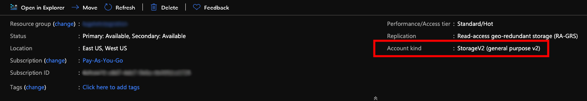

# Ship logs from Azure Blob Storage

Logz.io provides an automated deployment process to simplify the process of shipping logs from Azure Blob Storage.	
This integration forwards logs from your Azure Blob Storage	
to your Logz.io account.

<!-- tabContainer:start -->

* [Use your existing blob storage account](#existing-blob-config)
* [Create a new blob storage account](#new-blob-config)

<!-- tab:start -->

## Use your existing blob storage account

**Before you begin, you'll need**:
a blob storage account of the type **StorageV2 (general purpose v2)** . If your existing blob storage account is of any other kind, it will NOT work. Instead, follow the process to set up a new blob storage account.
Double-check your [_Storage accounts_](https://portal.azure.com/#blade/HubsExtension/BrowseResource/resourceType/Microsoft.Storage%2FStorageAccounts) to make sure that they are compatible. They should be of the type **StorageV2 (general purpose v2)**.

### 1. Configure an automated deployment

👇 Click this button to start the automated deployment.

You'll be taken to Azure,
where you'll configure the resources to be deployed.
Make sure to use the settings shown below.

| Parameter | Description |
|---|---|
| Resource group | Select your existing resource group, and then click **OK**. |
| Location | Select the same region as the Azure services that will stream data to this Blob Storage. |
| Logs listener host | Use the listener URL specific to the region of your Logz.io account. You can look it up [here](https://docs.logz.io/user-guide/accounts/account-region.html). |
| Logs account token | Add the [log shipping token](https://app.logz.io/#/dashboard/settings/general) for the relevant Logz.io account. This is the account you want to ship to.  |
| Format (Default: text) | Select one of the supported parsing formats: text/json/csv.  |
| Blob Storage Connection String | Insert your storage account connection string, for more information [click here](#connection-string).  |
| Buffersize (Default: 100) | The maximum number of messages the logger will accumulate before sending them all as a bulk.  |
| Timeout (Default: 180,000 = 3 minutes) | The read/write/connection timeout in *milliseconds*.  |

At the bottom of the page, agree to the terms and conditions. 
Then click **Purchase** to deploy.

Deployment can take a few minutes.

### 2. Add a blob container
In the
[_Storage accounts_](https://portal.azure.com/#blade/HubsExtension/BrowseResource/resourceType/Microsoft.Storage%2FStorageAccounts)
page, select the relevant StorageV2 account.

Click the **Containers** card to open it.

* If you don't yet have a blob container, build one now.
    
    Click **+ Container** in the toolbar. Give your container a meaningful **Name**, and select **Private** from the **Public access level** list. Press **OK** to create your container.

### 3. Build an event subscription

In your storage account, in the left menu, click **Events**.

Click **+ Event Subscription** in the toolbar.

#### In "EVENT SUBSCRIPTION DETAILS"

| Parameter | Description |
|---|---|
| Name | Give a meaningful name. |
| Event Schema | Select **Event Grid Schema** |

#### In "EVENT TYPES"

Give the event subscription a meaningful **Name**.

| Parameter | Description |
|---|---|
| Filter to Event Types | Select **Blob Created** only, and clear the remaining check boxes. |

#### In "ENDPOINT DETAILS"

| Parameter | Description |
|---|---|
| Endpoint Type | Select **Event Hubs**. |
| Endpoint | Click **Select an endpoint**, then select your resource group. |

Click **Create** to continue.

### 4. Check Logz.io for your logs

Give your logs some time to get from your system to ours, and then open [Kibana](https://app.logz.io/#/dashboard/kibana/discover?). 
Any logs sent from this point on should appear under the type `blobStorage`.

If you still don’t see your logs, see [log shipping troubleshooting](https://docs.logz.io/user-guide/log-shipping/log-shipping-troubleshooting.html).

On your storage account go to 'Access keys' tab. Copy the 'Connection string' of key1.

<!-- tab:end -->

<!-- tab:start -->

## Set up a new blob storage account

### 1. Configure an automated deployment

👇 Click this button to start the automated deployment.

You'll be taken to Azure,
where you'll configure the resources to be deployed.
Make sure to use the settings shown below.

#### In the BASICS section

| Parameter | Description |
|---|---|
| Resource group | Select your existing resource group, and then click **OK**. |
| Location | Select the same region as the Azure services that will stream data to this Blob Storage. |
| Logs listener host | Use the listener URL specific to the region of your Logz.io account. You can look it up [here](https://docs.logz.io/user-guide/accounts/account-region.html). |
| Logs account token | Add the [log shipping token](https://app.logz.io/#/dashboard/settings/general) for the relevant Logz.io account. This is the account you want to ship to.  |
| Format (Default: text) | Select one of the supported parsing formats: text/json/csv  |
| Buffersize (Default: 100) | The maximum number of messages the logger will accumulate before sending them all as a bulk  |
| Timeout (Default: 180,000 = 3 minutes) | The read/write/connection timeout in *milliseconds*.  |

At the bottom of the page, agree to the terms and conditions. 
Then click **Purchase** to deploy. 

Deployment can take a few minutes.

### 2. Check Logz.io for your logs

Give your logs some time to get from your system to ours, and then open [Kibana](https://app.logz.io/#/dashboard/kibana/discover?). 
Any logs sent from this point on should appear under the type `blobStorage`.

If you still don’t see your logs, see [log shipping troubleshooting](https://docs.logz.io/user-guide/log-shipping/log-shipping-troubleshooting.html).

<!-- tab:end -->

<!-- tabContainer:end -->

